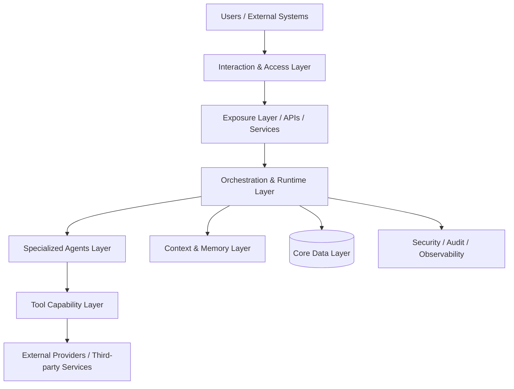
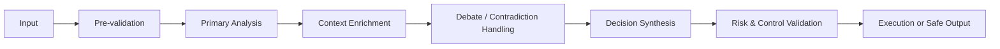
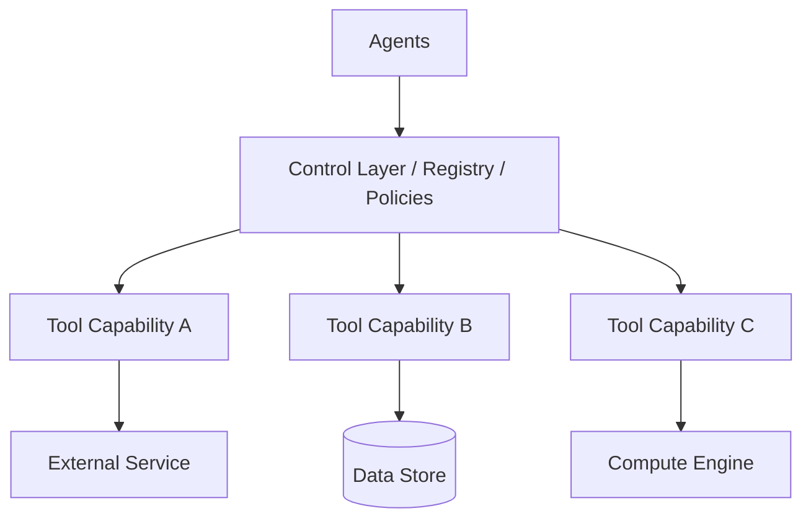

# Dossier d’Architecture Technique (DAT)
## Enterprise Multi-Agent Platform
### Ultra Premium Consulting Edition — With Technical References

**Document class**: Architecture & Transformation  
**Positioning**: Enterprise-grade / Board-ready / Delivery-aligned  
**Target systems**: Multi-agent AI platforms, decision engines, orchestration runtimes, intelligent automation systems, augmented expert systems

---

## 1. Document Governance

### 1.1 Document Identification

| Field | Value |
|---|---|
| Project name | [To be completed] |
| Program / Initiative | [To be completed] |
| Client / Entity | [To be completed] |
| Document title | Technical Architecture Dossier |
| Version | [To be completed] |
| Status | Draft / Under Review / Approved / Released |
| Classification | Internal / Confidential / Restricted |
| Date | [To be completed] |
| Authors | [To be completed] |
| Contributors | [To be completed] |
| Reviewers / Approvers | [To be completed] |

### 1.2 Purpose of the Document

This document formalizes the **target technical architecture** of the solution and provides a structured view of:
- the end-to-end architecture blueprint,
- the multi-agent operating model,
- the major technical components,
- the orchestration logic,
- the data and control flows,
- the security and compliance principles,
- the observability and operability model,
- the key architectural decisions,
- the associated risks, constraints, and evolution path.

### 1.3 Scope

**In scope**
- target architecture of the platform,
- multi-agent orchestration principles,
- runtime, tools, memory, data, security, operations,
- infrastructure and deployment model,
- industrialization principles.

**Out of scope**
- detailed backlog and sprint-level delivery planning,
- exhaustive functional specifications,
- vendor contractual commitments,
- low-level implementation details not relevant to architecture governance.

### 1.4 Reference Inputs

- business requirements and framing materials,
- functional architecture inputs,
- security and compliance requirements,
- performance and availability targets,
- integration constraints,
- operational and infrastructure standards,
- provider and third-party dependency constraints.

---

## 2. Executive Summary

### 2.1 Business Context

The target solution addresses the need for an **enterprise-grade intelligent decision and execution platform**, capable of orchestrating multiple specialized AI agents, technical services, and external systems in a controlled, auditable, and scalable manner.

### 2.2 Strategic Ambition

The platform is positioned as a **core operational intelligence capability**, enabling the organization to:
- structure specialized machine reasoning at scale,
- govern multi-agent collaboration,
- control sensitive execution paths,
- industrialize AI-assisted operations,
- create a reusable foundation for future AI-enabled business domains.

### 2.3 Architectural Intent

The target architecture is built around five strategic design intentions:

1. **Governed intelligence**  
   AI capabilities must remain structured, bounded, and controllable.

2. **Operational reliability**  
   The platform must support production-grade execution, with clear degradation and fallback modes.

3. **Scalable modularity**  
   Functional growth must not create architectural fragility.

4. **Auditability and explicability**  
   Decisions, tool calls, memory usage, and execution outcomes must remain traceable.

5. **Sustainable industrialization**  
   The architecture must remain maintainable, cost-conscious, and extensible over time.

### 2.4 Executive Architectural Synthesis

The solution relies on a **layered multi-agent architecture** composed of:
- an interaction and exposure layer,
- a governed orchestration and runtime layer,
- a set of specialized AI agents,
- a secured tool capability layer,
- a hybrid context and memory layer,
- a resilient data backbone,
- and a full-stack observability and security framework.

### 2.5 Key Structuring Decisions

| Topic | Target decision | Rationale |
|---|---|---|
| orchestration model | hybrid orchestration combining deterministic workflow and agentic runtime | balance between business control and adaptive execution |
| agent specialization | role-specific agents with explicit responsibilities | improve reasoning quality, traceability and maintainability |
| framework strategy | AgentScope as reference framework, progressive integration approach | standardize abstractions without destabilizing existing runtime assets |
| tool access model | policy-driven controlled tool exposure | reduce operational and security risk |
| memory strategy | hybrid memory model combining transactional, scoped and vector memory | preserve context while maintaining governance |
| provider strategy | pluggable provider facade with fallback capacity | reduce dependency concentration and improve resilience |
| observability model | native metrics, traces, structured logs and run-level audit | enable enterprise operations and control |

---

## 3. Architecture Principles

### 3.1 Enterprise Architecture Principles

- business-aligned design
- strong modularity
- low coupling / high cohesion
- explicit governance boundaries
- resilience by design
- security by design
- observability by default
- operational traceability
- progressive industrialization
- sustainability and sobriety by design

### 3.2 Multi-Agent Specific Principles

- clear specialization of agent roles
- explicit authority boundaries per agent
- controlled tool access and execution permissions
- governed arbitration between divergent outputs
- bounded autonomy loops
- human-safe or system-safe fallback behavior
- systematic traceability of intermediate and final decisions
- quality gates before sensitive actions
- cost and latency awareness across the full execution chain

---

## 4. Target Architecture Overview

### 4.1 High-Level Description

The platform is structured as a **governed multi-agent execution system** in which incoming requests are validated, contextualized, processed through specialized agent workflows, enriched via tools and memory, arbitrated through runtime controls, and ultimately converted into a safe output or action.

### 4.2 High-Level Logical Architecture

### 4.3 Logical Layers

| Layer | Purpose | Typical components |
|---|---|---|
| Interaction | human or system interaction entry points | frontend, operator UI, external clients |
| Exposure | contractual service exposure | API layer, authentication, request validation |
| Orchestration | workflow governance and execution steering | orchestrator, planner, runtime, dispatcher |
| Intelligence | specialized reasoning and decision units | analyst agents, researcher agents, decision agents |
| Capabilities | controlled access to specialized functions | tool registry, MCP tools, adapters |
| Context & Memory | contextual continuity and learning | short-term memory, vector memory, session state |
| Data Backbone | persistence and exchange backbone | relational DB, cache, broker, vector store |
| Control Plane | supervision and trust mechanisms | logs, metrics, traces, dashboards, audit controls |

---

## 5. Multi-Agent Operating Model

### 5.1 Rationale for the Multi-Agent Model

The multi-agent model is adopted to address tasks that require:
- multiple perspectives,
- decomposition of complex reasoning,
- domain-specific specialization,
- structured contradiction handling,
- progressive consolidation toward a final controlled output.

### 5.2 Agent Typology

| Agent | Category | Primary role | Expected output |
|---|---|---|---|
| Technical Analyst | analysis | technical pattern and signal analysis | structured technical assessment |
| News Analyst | analysis | event/news impact analysis | structured event-driven assessment |
| Market Context Analyst | analysis | macro/context synthesis | contextual environment assessment |
| Bullish Researcher | debate | pro-thesis argumentation | bullish evidence package |
| Bearish Researcher | debate | counter-thesis argumentation | bearish evidence package |
| Trader Agent | decision | synthesis and directional proposal | proposed trade or decision |
| Risk Manager | validation | risk and exposure controls | risk validation / rejection |
| Execution Manager | execution | final execution preparation | execution-ready output |

### 5.3 Governance of Inter-Agent Collaboration

The inter-agent model must specify:
- execution sequence or triggering conditions,
- context propagation rules,
- confidence and evidence handling,
- contradiction resolution logic,
- arbitration ownership,
- no-op / hold / safe-block policies.

---

## 6. Agentic Workflow Architecture

### 6.1 Target Workflow Pattern

1. input validation and contextual loading,
2. primary analytical assessment,
3. enrichment and tool-assisted evidence gathering,
4. contradiction and debate phase,
5. synthesis and directional decision,
6. risk and policy validation,
7. execution preparation or safe non-execution,
8. result persistence, monitoring and feedback capture.

### 6.2 Workflow Illustration

---

## 7. Runtime and Orchestration Model

### 7.1 Strategic Role of the Runtime

The runtime acts as the **operational control center** of the platform. Its responsibilities include:
- planning,
- execution steering,
- state tracking,
- arbitration support,
- memory interaction,
- error handling,
- result publication,
- end-to-end instrumentation.

### 7.2 Framework Alignment

The target architecture may rely on **AgentScope** as the reference agent framework to standardize:
- agent abstractions,
- multi-agent collaboration patterns,
- tool interaction patterns,
- memory integration mechanisms,
- observability alignment.

**AgentScope Runtime** may complement this model as a production-grade execution layer for:
- sandboxed tool execution,
- Agent-as-a-Service exposure,
- scalable deployment patterns,
- stronger runtime standardization.

---

## 8. Technical Stack of Reference

### 8.1 Stack Overview

| Domain | Reference choice | Purpose | Official documentation |
|---|---|---|---|
| Backend API | FastAPI | API framework | [FastAPI Docs](https://fastapi.tiangolo.com/) |
| ASGI Server | Uvicorn | application server | [Uvicorn Docs](https://www.uvicorn.org/) |
| Agent Framework | AgentScope | agent abstractions and multi-agent workflows | [AgentScope GitHub](https://github.com/agentscope-ai/agentscope) |
| Agent Runtime | AgentScope Runtime | secure runtime, tool sandboxing, AaaS | [AgentScope Runtime GitHub](https://github.com/agentscope-ai/agentscope-runtime) |
| LLM Provider Layer | Ollama | local / self-hosted model serving | [Ollama Docs](https://docs.ollama.com/) |
| LLM Provider Layer | Mistral AI | hosted LLM APIs | [Mistral Docs](https://docs.mistral.ai/) |
| Relational Database | PostgreSQL | transactional persistence | [PostgreSQL Docs](https://www.postgresql.org/docs/) |
| Vector Extension | pgvector | vector search in PostgreSQL | [pgvector GitHub](https://github.com/pgvector/pgvector) |
| Vector Database | Qdrant | semantic/vector retrieval | [Qdrant Docs](https://qdrant.tech/documentation/) |
| Cache | Redis | cache and transient state | [Redis Docs](https://redis.io/docs/latest/) |
| Message Broker | RabbitMQ | async execution backbone | [RabbitMQ Docs](https://www.rabbitmq.com/docs) |
| Frontend | React | user interface layer | [React Docs](https://react.dev/) |
| Reverse Proxy / Static Serving | NGINX | frontend serving and proxying | [NGINX Docs](https://nginx.org/en/docs/) |
| Metrics | Prometheus | metrics collection and alerting | [Prometheus Docs](https://prometheus.io/docs/introduction/overview/) |
| Dashboards | Grafana | visualization and dashboards | [Grafana Docs](https://grafana.com/docs/) |
| Telemetry Standard | OpenTelemetry | traces, metrics, logs instrumentation | [OpenTelemetry Docs](https://opentelemetry.io/docs/) |

### 8.2 Technology Selection Rationale

| Domain | Choice | Why this choice |
|---|---|---|
| Backend API | FastAPI | strong Python API ergonomics, async support, automatic OpenAPI generation |
| ASGI Server | Uvicorn | lightweight ASGI server aligned with FastAPI and WebSocket support |
| Agent Framework | AgentScope | modern agent abstractions, multi-agent orientation, production-focused positioning |
| Runtime | AgentScope Runtime | secure tool sandboxing, runtime industrialization, scalable deployment model |
| Relational DB | PostgreSQL | mature transactional engine with strong ecosystem |
| Vector in RDBMS | pgvector | enables similarity search directly in PostgreSQL |
| Dedicated Vector DB | Qdrant | specialized semantic search and vector retrieval |
| Cache | Redis | low-latency cache and transient operational state |
| Broker | RabbitMQ | mature messaging backbone for decoupled async processing |
| Frontend | React | component-based UI ecosystem and wide adoption |
| Reverse Proxy | NGINX | robust serving and reverse proxy layer |
| Metrics | Prometheus | standard pull-based metrics and alerting ecosystem |
| Visualization | Grafana | broad dashboarding support across metrics, logs, and traces |
| Telemetry | OpenTelemetry | vendor-neutral instrumentation standard |

---

## 9. Application Architecture – Backend Reference Modules

### 9.1 Orchestration Modules

| Domain | Reference module | Architectural responsibility |
|---|---|---|
| business orchestration | `app/services/orchestrator/` | primary multi-agent workflow, autonomy loops, memory loading, re-analysis |
| advanced runtime | `app/services/agent_runtime/` | dynamic plan-based runtime, tool selection, session state and MCP bridge |
| memory services | `app/services/memory/` | vector memory, long-term memory, feedback and outcome backfill |
| LLM services | `app/services/llm/` | provider abstraction, retry, model selection, shared helpers |
| risk services | `app/services/risk/` | risk validation per asset class and control rules |
| trading services | `app/services/trading/` | broker integration, account selection, live supervision |
| market services | `app/services/market/` | market data, classification, symbol mapping |
| execution services | `app/services/execution/` | action orchestration and order execution |
| observability | `app/observability/` | metrics, tracing context, exposure of telemetry |

### 9.2 Frontend Reference Modules

| Domain | Examples | Responsibility |
|---|---|---|
| operator interface | dashboard, run detail, orders, backtests | monitoring, control and business interaction |
| connectors management | providers, market data, memory endpoints | platform configuration |
| authentication | login and access control | secure access to the platform |
| hooks layer | auth, trading data, symbols, orders | business state consumption and refresh logic |

---

## 10. Tool Capability Layer

### 10.1 Purpose

The tool layer provides **controlled, reliable and auditable access** to specialized capabilities required by the agents.

### 10.2 Target Design

### 10.3 Control Principles

- allowlist per agent,
- parameter validation,
- quotas and limits,
- timeouts,
- full audit trace,
- sandboxing for sensitive actions,
- explicit refusal of unauthorized calls.

---

## 11. Context, Memory and Learning

### 11.1 Architectural Intent

Memory is used to improve quality and continuity without compromising governance. The memory model must therefore balance:
- usefulness,
- freshness,
- trustworthiness,
- isolation,
- retrievability,
- cost.

### 11.2 Memory Types

- execution memory,
- short-term run memory,
- long-term memory,
- vector memory,
- agent-scoped memory,
- shared contextual memory.

---

## 12. Data Architecture

### 12.1 Reference Data Components

| Type | Reference technology | Purpose |
|---|---|---|
| relational | PostgreSQL | transactional persistence |
| vector | Qdrant / pgvector | semantic retrieval |
| cache | Redis | performance and temporary state |
| broker | RabbitMQ | asynchronous exchange |
| object storage | [To be defined if needed] | artifacts and large payloads |

---

## 13. Security Architecture

### 13.1 Security Foundations

- least privilege
- defense in depth
- strong secret separation
- data protection by design
- tool execution governance
- full auditability of sensitive decisions

### 13.2 Agentic Security Controls

#### 13.2.1 Logical Isolation of Agents

Each agent operates within a logically isolated execution perimeter. This isolation ensures that no agent may directly access the internal state, data, or outputs of another agent without passing through the orchestrator’s governed communication channel.

| Principle | Implementation approach |
|---|---|
| execution space isolation | each agent operates within its own execution context, not shared by default |
| no direct inter-agent communication | all exchanges are routed through the orchestrator |
| session partitioning | sessions are isolated across runs and across users |
| memory namespace separation | each agent can access only its allocated memory zone |

#### 13.2.2 Differentiated Permissions by Role

Access rights to tools, data, and execution capabilities are defined by agent role, following the principle of least privilege.

| Agent | Category | Authorized tool access | Data access | Action permissions |
|---|---|---|---|---|
| Technical Analyst | analysis | `market_data`, `indicators` | read-only | no external action |
| News Analyst | analysis | `news_feed`, `event_db` | read-only | no external action |
| Market Context Analyst | analysis | `macro_data`, `context_store` | read-only | no external action |
| Bullish Researcher | debate | `search`, `retrieval` | read-only | no external action |
| Bearish Researcher | debate | `search`, `retrieval` | read-only | no external action |
| Trader Agent | decision | `decision_tools` | enriched read access | proposal only |
| Risk Manager | validation | `risk_rules`, `exposure_api` | read + validation | validation / rejection |
| Execution Manager | execution | `broker_adapter`, `order_api` | read + write | execution after validation |

> Note: The effective permission matrix must be defined and maintained in the access control registry. **Reference to be completed:** [tool, policy registry, or control document].

#### 13.2.3 Input and Output Validation

Every inbound and outbound data flow crossing an agent boundary must be validated before processing or transmission.

**Input validation controls**
- validation of the inbound request schema,
- verification of mandatory field completeness,
- detection of injection attempts or prompt manipulation,
- control of the size and format of transmitted context,
- verification of provenance (authorized source layer or agent).

**Output validation controls**
- validation of the expected structured format,
- detection of sensitive or non-compliant content,
- coherence control on the produced decision or recommendation,
- blocking of outputs with insufficient confidence (`confidence_score < [threshold to be defined]`),
- marking of non-validable outputs for human arbitration.

#### 13.2.4 Audit of Tool Calls

Each tool invocation performed by an agent must generate an immutable audit record tracing the full execution cycle.

| Audit field | Description |
|---|---|
| `run_id` | unique identifier of the execution run |
| `agent_id` | identifier of the calling agent |
| `tool_name` | name of the invoked tool |
| `tool_version` | version of the tool |
| `parameters_hash` | fingerprint of transmitted parameters |
| `timestamp_call` | timestamp of the invocation |
| `timestamp_response` | timestamp of the response |
| `status` | success / failure / refusal / timeout |
| `refusal_reason` | refusal reason if applicable |
| `caller_context` | calling context (workflow step, active authorization) |

Audit log retention is set to **[duration to be defined]**. Storage is **[to be specified: target log centralization system]**.

#### 13.2.5 Explicit Control of Side Effects

Any action capable of producing an observable external effect (broker call, database write, notification, third-party API trigger) is subject to mandatory prior control.

**Application principles**
- every side-effect-producing action is categorized and recorded in the sensitive actions registry,
- effective execution is conditional upon validation by the Risk Manager and/or the Execution Manager,
- no analysis or debate agent may trigger a side effect,
- non-declared side effects are blocked by default (`deny-by-default`),
- unauthorized attempts are logged and trigger an alert.

#### 13.2.6 Safe-Block Security Policies

Whenever abnormal conditions are detected, the system must apply a safe-block policy before any irreversible action is taken.

| Trigger condition | Target behavior |
|---|---|
| insufficient confidence score | place in hold state, escalate to arbitration |
| unresolved contradiction between agents | suspend execution, raise alert log |
| unauthorized tool call | immediate refusal, audit entry, operator alert |
| token or latency budget exceeded | safe-stop, partial result logged |
| LLM provider unavailable | provider fallback or controlled degradation |
| detection of anomalous agent behavior | isolate the agent, notify **[alert channel to be defined]** |
| execution attempt without Risk Manager validation | full block, critical log |

Safe-block triggering thresholds must be configurable and documented in **[policy registry or configuration reference]**.

---

## 14. Performance, Resilience and Scalability

### 14.1 Performance Levers

- parallelization where value-creating,
- cache usage,
- context size optimization,
- per-agent latency budgets,
- external call optimization,
- runtime overhead reduction.

### 14.2 Resilience Mechanisms

- timeout policies,
- retry with backoff,
- circuit breakers,
- provider fallback,
- partial safe responses,
- controlled degraded modes,
- hold / no-op behavior.

---

## 15. Observability, Audit and Operability

### 15.1 Logging

- structured logs,
- run-correlated logs,
- agent-level logs,
- tool-level logs,
- sensitive action logs.

### 15.2 Metrics

- number of runs,
- duration by step,
- errors by agent,
- tool latency,
- fallback rates,
- memory health,
- cache behavior,
- LLM token/cost/latency metrics,
- provider health.

### 15.3 Tracing

- correlation IDs,
- causation IDs,
- end-to-end propagation,
- cross-layer traceability.

---

## 16. Deployment and Infrastructure Model

### 16.1 Target Environments

| Environment | Purpose |
|---|---|
| local | development |
| dev | integration |
| test | validation |
| preproduction | production rehearsal |
| production | business operations |

### 16.2 Reference Infrastructure Components

| Component | Technology | Standard port |
|---|---|---|
| database | PostgreSQL 15 + pgvector | 5432 |
| cache | Redis 7 | 6379 |
| broker | RabbitMQ | 5672 |
| vector DB | Qdrant | 6333 |
| backend | FastAPI + Uvicorn | 8000 |
| frontend | React + NGINX | 3000 |
| monitoring | Prometheus + Grafana | 9090 / 3001 |

---

## 17. Ecological and Digital Sobriety Requirements

### 17.1 Strategic Principle

The architecture must embody **digital sobriety by design**, especially given the potentially high compute and inference footprint of multi-agent AI systems.

### 17.2 Operational Levers

- selective activation of agents,
- bounded retries and loops,
- cache-first enrichment,
- context size reduction,
- retention and purge policies,
- lighter model usage where acceptable,
- conditional activation of expensive enrichments.

---

## 18. Architecture Decisions and Trade-Offs

### 18.1 Major Options Considered

| Topic | Option A | Option B | Target direction | Rationale |
|---|---|---|---|---|
| orchestration | purely internal runtime | hybrid runtime with framework alignment | hybrid | best balance between control and standardization |
| framework strategy | fully custom framework | AgentScope progressive adoption | progressive adoption | industrialization without destabilization |
| tool layer | direct service calls | governed registry / MCP / runtime mediation | governed registry | security and auditability |
| memory strategy | transactional only | hybrid transactional + vector | hybrid | better contextual intelligence |
| provider strategy | single provider | pluggable providers with fallback | pluggable | resilience and cost control |

---

## 19. Risks and Mitigations

| Risk | Impact | Probability | Mitigation |
|---|---|---|---|
| excessive latency | high | medium | latency budgets, caching, selective execution |
| inter-agent conflict | medium to high | medium | arbitration policy and hold state |
| provider dependency | high | medium | multi-provider fallback strategy |
| memory quality drift | medium | medium | freshness and trust controls |
| cost escalation | high | medium | model selection governance and sobriety KPIs |
| uncontrolled framework overlap | medium | medium | progressive adoption strategy |

---

## 20. Testing and Validation Strategy

### 20.1 Expected Test Coverage

- unit tests,
- integration tests,
- end-to-end tests,
- orchestration tests,
- runtime tests,
- tool tests,
- memory tests,
- performance tests,
- resilience tests,
- security tests.

---

## 21. Evolution Roadmap

- MVP
- V1 production stabilization
- V2 advanced runtime industrialization
- V3 deeper AgentScope integration
- V4 high availability and cost optimization
- V5 multi-tenant / multi-domain expansion

---

## 22. Technical References Appendix

### 22.1 Backend and Runtime

| Technology | Official documentation | Recommended entry point |
|---|---|---|
| FastAPI | https://fastapi.tiangolo.com/ | Tutorial: https://fastapi.tiangolo.com/tutorial/ |
| Uvicorn | https://www.uvicorn.org/ | Settings / deployment: https://www.uvicorn.org/settings/ |
| AgentScope | https://github.com/agentscope-ai/agentscope | Repository README and docs folder |
| AgentScope Runtime | https://github.com/agentscope-ai/agentscope-runtime | Install guide: https://github.com/agentscope-ai/agentscope-runtime/blob/main/cookbook/en/install.md?plain=true |

### 22.2 Data, Cache and Messaging

| Technology | Official documentation | Recommended entry point |
|---|---|---|
| PostgreSQL | https://www.postgresql.org/docs/ | Getting started: https://www.postgresql.org/docs/current/tutorial-start.html |
| pgvector | https://github.com/pgvector/pgvector | Python integration: https://github.com/pgvector/pgvector-python |
| Qdrant | https://qdrant.tech/documentation/ | Quickstart: https://qdrant.tech/documentation/quickstart/ |
| Redis | https://redis.io/docs/latest/ | Open Source getting started: https://redis.io/docs/latest/get-started/ |
| RabbitMQ | https://www.rabbitmq.com/docs | Tutorials: https://www.rabbitmq.com/tutorials |

### 22.3 Frontend and Edge

| Technology | Official documentation | Recommended entry point |
|---|---|---|
| React | https://react.dev/ | Learn: https://react.dev/learn |
| NGINX | https://nginx.org/en/docs/ | Beginner's guide: https://nginx.org/en/docs/beginners_guide.html |

### 22.4 Observability

| Technology | Official documentation | Recommended entry point |
|---|---|---|
| Prometheus | https://prometheus.io/docs/introduction/overview/ | Getting started: https://prometheus.io/docs/prometheus/latest/getting_started/ |
| Grafana | https://grafana.com/docs/ | Fundamentals: https://grafana.com/docs/grafana/latest/fundamentals/ |
| OpenTelemetry | https://opentelemetry.io/docs/ | Collector: https://opentelemetry.io/docs/collector/ |

### 22.5 LLM Providers

| Technology | Official documentation | Recommended entry point |
|---|---|---|
| Ollama | https://docs.ollama.com/ | API intro: https://docs.ollama.com/api/introduction |
| Mistral AI | https://docs.mistral.ai/ | Quickstart: https://docs.mistral.ai/getting-started/quickstart |

### 22.6 Usage Guidance for Reviewers and Delivery Teams

For each technical choice, reviewers should validate at minimum:
- maturity and support model,
- deployment compatibility,
- security posture,
- scalability characteristics,
- operational tooling,
- integration cost,
- fallback and reversibility options.

---

## 23. Source Basis for This Reference Section

This DAT reference section was aligned against the official documentation or official repositories of the selected technologies at the time of writing. Review before final approval is recommended in case of version drift.
